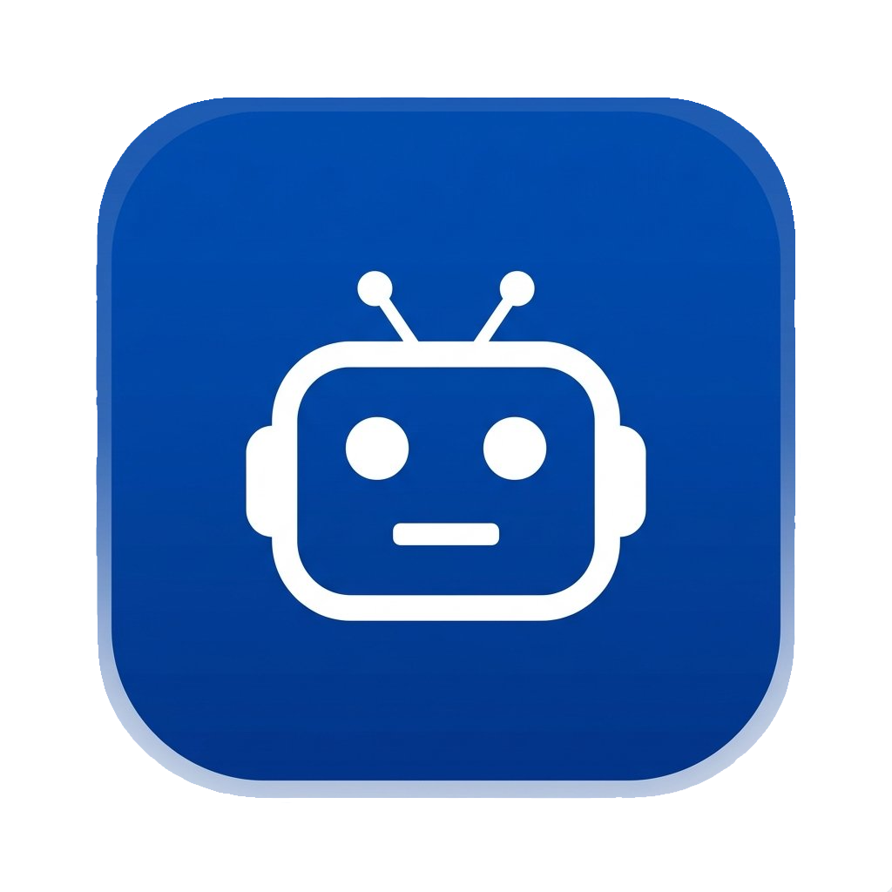

<div align="center">
  
</div>

# 🌟 Nexa Point

Welcome to **Nexa Point**! 🚀 This is an intelligent and beautifully designed AI chatbot application built with modern web technologies. 

This project was developed with a specific purpose in mind: **to successfully complete the final project task for the Hacktiv8 "Maju Bareng AI for Developer" program.** It showcases the integration of powerful generative AI within a sleek, production-ready frontend interface.

## 🎯 Project Goal

The primary objective of Nexa Point is to demonstrate a deep understanding of AI integrations in modern web development. Created for the **Hacktiv8: Maju Bareng AI for Developer** program, this project highlights key skills such as prompt engineering, seamless API integration, state management, and creating a premium user experience (UX) with responsive design.

## ✨ Features

- **🧠 Multiple AI Personas:** Switch between specialized assistants like a Travel Planner, Financial Consultant, or Copywriter.
- **💬 Persistent Local History:** Your chat sessions are securely saved locally using `localStorage`, allowing you to resume conversations right where you left off.
- **🎨 Premium UI/UX:** Built with a stunning, minimalist design featuring both Dark and Light modes, smooth animations, and custom typography.
- **⚡ Real-time Streaming:** Enjoy fast, real-time responses powered by the Google Gemini API via Vercel AI SDK.
- **📝 Markdown Support:** Code blocks, lists, and formatting are beautifully rendered in the chat.
- **🛡️ Secure API Handling:** API keys and sensitive operations are securely handled on the server side.

## 🛠️ Tech Stacks

Nexa Point is built on the shoulders of giants. Here are the core technologies powering the app:

- **Framework:** [Next.js (App Router)](https://nextjs.org/)
- **Library:** [React 19](https://react.dev/)
- **AI Integration:** [Vercel AI SDK](https://sdk.vercel.ai/docs) & [Google AI SDK (Gemini)](https://ai.google.dev/)
- **Styling:** [Tailwind CSS v4](https://tailwindcss.com/)
- **UI Components:** [HeroUI](https://heroui.com/) & [Base UI](https://base-ui.com/)
- **Animations:** [Framer Motion](https://www.framer.com/motion/)
- **Markdown Rendering:** [React Markdown](https://github.com/remarkjs/react-markdown) & Remark GFM

## 📋 Requirements

Before you begin, ensure you have the following installed on your machine:
- **Node.js** (v20 or higher recommended)
- **npm** (v9 or higher), **yarn**, or **pnpm**

## 🔑 How to Get a Gemini API Key

To run this application locally, you will need a valid Google Gemini API key. Follow these steps to get one:

1. Visit the [Google AI Studio](https://aistudio.google.com/).
2. Sign in with your Google Account.
3. Click on the **"Get API key"** or **"Create API key"** button.
4. Generate a new key and copy it securely. You will need this for the `.env.local` setup.

## 🚀 Installation & Running Locally

Ready to try Nexa Point? Follow these simple steps to get the app running on your local machine:

1. **Clone the repository:**
   ```bash
   git clone <your-repo-url>
   cd nexa-point
   ```

2. **Install dependencies:**
   ```bash
   npm install
   # or
   yarn install
   # or
   pnpm install
   ```

3. **Set up environment variables:**
   Create a new file named `.env.local` in the root directory of your project and add your Gemini API key:
   ```env
   GEMINI_API_KEY=your_copied_api_key_here
   ```

4. **Run the development server:**
   ```bash
   npm run dev
   # or
   yarn dev
   # or
   pnpm dev
   ```

5. **Open the app:**
   Open your browser and navigate to [http://localhost:3000](http://localhost:3000) to see the application in action! 🎉

## 🤝 Acknowledgments

A huge thank you to **Hacktiv8** for the "Maju Bareng AI for Developer" program, providing the knowledge and opportunity to build this exciting project!
